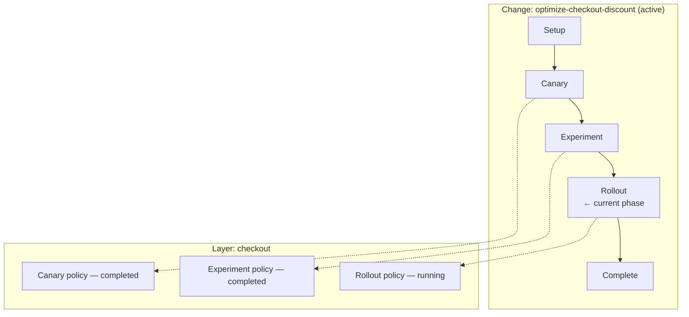

A **change** is a product initiative — "optimize the checkout discount", "ship the new onboarding flow" — moved through a measured lifecycle. Where a [policy](/concepts/policies) answers *which users get which values right now*, a change answers the product questions around it: what are you trying to achieve, how you'll know it worked, what could go wrong, and who signs off at each step.

Changes wrap the raw [layer](/concepts/layers) and policy mechanics in governance and measurement by default. Every change records intent before it carries traffic. Every traffic-bearing phase requires an approved measurement plan. Every transition is checked, optionally approved, and written to the [decision log](/dashboard/decisions).

<Note>
The Changes surface is enabled per organization. If you don't see **Changes** in the project sidebar, it isn't enabled for your organization yet.
</Note>

## Why changes exist

Policies are precise but low-level: bucket ranges, priorities, allocations. Nothing in a policy says *why* it exists, what counts as success, or whether anyone approved exposing users to it. A change makes the safe path the default path:

- **Intent first** — you can't create a change without stating what it's for.
- **Measurement before traffic** — no traffic until a measurement plan is approved (or qualifies for auto-approval).
- **Guardrails while running** — each phase is monitored against its plan's guardrails, with configurable responses to breaches.
- **An audit trail throughout** — every start, advance, promotion, completion, and revert produces a decision record with the evidence it was based on.

## Lifecycle templates

When you create a change you pick one of three lifecycle templates. The template determines the phases the change moves through and the allocation shape it serves.

| Template | Phases | Allocations |
|----------|--------|-------------|
| **Gradual rollout** | setup → canary → rollout → complete | One treatment. The rest of traffic keeps the current default — no control allocation, no A/B comparison. |
| **Canary → Experiment → Rollout** | setup → canary → experiment → rollout → complete | Control vs one treatment. Control is implicit — the current parameter default — so the result compares the winner against the real status quo. |
| **Adaptive optimization** | setup → adaptive → complete | Control plus multiple candidate allocations, continuously optimized within guardrails. |

The wizard recommends a template based on the change's computed [risk class](#risk-class). A low-risk change is recommended **Gradual rollout** — skip the experiment phase, validate on a canary, ramp. Medium risk and above is recommended **Canary → Experiment → Rollout**: validate safety on a small slice, measure impact properly in the experiment phase, then ramp the winner. **Adaptive optimization** is never auto-recommended — you pick it deliberately.

## Phases

Each phase is a lifecycle step with its own configuration, state, and outcome.

- **Setup** — the drafting stage. You define the allocation values, surfaces, and objective. No traffic is served; a change can sit in setup indefinitely.
- **Canary** — a small traffic slice (1% by default) to validate safety before committing. Canaries are judged on health metrics and the plan's minimums (runtime, exposure events), not on winning.
- **Experiment** — a 50/50 control-vs-treatment test measuring the objective. It runs until the evidence supports a verdict: winner selected, no winner, or inconclusive.
- **Rollout** — ramps the winning allocation toward the full layer in health-gated steps. See [rollouts](/experimentation/rollouts) for the ramp mechanics.
- **Adaptive** — an adaptive policy shifts traffic toward better-performing allocations within the plan's guardrails. Bandits need volume to learn, so adaptive phases default to the whole layer rather than a canary slice.
- **Complete** — the terminal step. The winning values are promoted to the parameter defaults, and the change closes with a recorded outcome.

Five transitions move a change between phases: **start**, **advance**, **promote** (select a winner), **complete**, and **revert**. Each transition shows a preview — resolved traffic placement, readiness checks, approval requirements, and the decision record it will write — before you confirm.

<Tip>
**A/B canaries reserve ahead.** In the canary → experiment → rollout template, the canary reserves the experiment phase's full traffic share up front (50% of the layer by default) but serves only the canary percentage of each allocation — the transition preview shows both the served and the reserved share. Advancing to the experiment phase reuses the same buckets, so a user who was in the treatment allocation during the canary stays there. No cohort is contaminated by re-randomization.
</Tip>

## How changes relate to policies and layers

A change owns product intent. Policies still own runtime assignment. The bridge between them: **each traffic-carrying phase materializes one policy in a layer**.

When a phase starts, Traffical creates a new policy for it: it resolves free bucket space in the layer, builds the allocations from the values defined in setup, and attaches the approved measurement plan's metrics and guardrails. When the change advances, the previous phase's policy is completed and a new one is created for the next phase. Completed policies remain as the change's history — each phase's evidence is anchored to the policy that produced it.

This is the reconciliation between the two lifecycles you'll see in the product:

| Change state | Phase state | Policy state |
|--------------|-------------|--------------|
| `draft` | `planned` | No policy serving yet |
| `active` | `running` | Current phase's policy is `running`; earlier phases' policies are `completed` |
| `paused` | `paused` | Current phase's policy is `paused` — users fall through to the next policy or to the parameter defaults |
| `completed` | `completed` | Final policy `completed`; winning values promoted to parameter defaults |
| `archived` | terminal | All phase policies archived; their bucket space is released. Abandoning an active change skips its planned phases and fails the running one, with the reason recorded. |

The change never owns bucket ranges, priorities, or ramp state — those stay on the policy, resolved fresh at each transition. You can still work at the policy level directly; changes are a layer of meaning and governance on top, not a replacement.

<Note>
An existing standalone policy can be wrapped into a change, which is how pre-existing policies appear in the Changes list. The wrapped change mirrors the policy's current state — a running policy becomes an active change.
</Note>

## Intent, objective, and success criteria

Every change carries its own definition of success:

- **Intent** (required) — a plain statement of what this change is for. You cannot create a change without it.
- **Objective** — an optional measurable target: a primary metric, a direction (`increase`, `decrease`, or `maintain`), and optionally a numeric target.
- **Success criteria** — human-readable conditions for safe advancement or completion.
- **Risks** — known risks to monitor while the change moves through its phases.
- **Surfaces** — the primary [surface](/concepts/surfaces) where the change lands, plus any additional impacted surfaces.

These aren't decoration. The objective's primary metric becomes the phase policy's goal metric, the surfaces drive the risk class, and the risks and criteria stay on the change that every approval and decision record points back to.

## Risk class

Every change gets a computed risk class — `low`, `medium`, `high`, or `critical`. Traffical computes it from the change's surfaces and how its parameters are consumed: frontend, email, and notification surfaces start low; backend and data surfaces start medium; ranking and AI surfaces start high. A parameter binding that can mutate behavior — a decision, write, or side-effect binding — bumps the class one rung.

The computed class is a baseline, not a lock. You can adjust it in the wizard — raising it needs no justification, but lowering it below the computed class requires a stated reason, which is recorded on the change's audit trail.

The risk class determines how much friction each transition carries: which starts auto-approve, which require human sign-off, and how much autonomy agents get. See [approvals and autonomy](/governance/approvals-and-autonomy) for the full model.

## The measurement plan requirement

The core rule: **traffic requires an approved measurement plan**. No traffic-bearing phase — canary included — starts without one.

The plan is resolved from your organization's certified [measurement protocols](/governance/measurement-protocols): which metrics must be measured, which guardrails apply per phase, and what minimums gate advancement. What happens at start depends on what resolved:

- **Approved plan exists** — the start proceeds; the plan's metrics and guardrails are attached to the phase policy.
- **Clean, low-risk, certified coverage** — the system approves the plan automatically and proceeds. This is the only auto-approval cell; it never applies when the plan has unresolved risks.
- **Anything else** — the start is blocked until a human approves the plan in the change's **Plan** tab.

Overrides exist, but they are annotations, not bypasses: an override reason is stamped into the decision record for audit — it does not unlock traffic that the gate blocked.

## Per-phase automation

Each traffic-bearing phase carries an automation setting that controls what happens when the monitor's evidence supports a recommendation:

| Setting | Behavior when the evidence says "advance" |
|---------|-------------------------------------------|
| `manual` | Nothing happens automatically. The dashboard surfaces the recommendation; a human acts. |
| `propose` (default) | A proposal is written to the decision log for a human to approve or reject. |
| `auto` | The transition executes automatically. |

New changes default to `propose` — the system recommends, a human confirms. `auto` is an explicit per-phase opt-in. Adaptive phases take their advance mode from the approved measurement plan instead.

Guardrail breaches have their own responses, independent of the advance setting:

- **Blocking breach** — `pause` the phase (default), `revert` it, or `none`.
- **Warning breach** — `flag` it in the dashboard (default) or `pause`.

A pause lands on the phase's policy, so affected users immediately fall through to the next policy or to the parameter defaults. A blocking breach always escalates past an active warning.

## Who can act on a change

Humans act through the dashboard — the [Changes pages](/dashboard/changes) cover creating, advancing, approving, and completing, gated by [roles and permissions](/governance/roles-and-permissions).

Agents act through the [MCP server](/tools/mcp-server) — under the same governance, not around it. An agent's effective autonomy per action is resolved from the change's risk class and your organization's autonomy policies. Safety actions (pause, revert, reduce traffic) are never gated on risk class — the risk matrix always clears them for direct execution, subject to the agent's granted scope and the organization's write mode. Expanding traffic executes directly only on low-risk changes. Promoting a winner into the product default is always a proposal — a mandatory human checkpoint. A proposal binds the evidence snapshot the agent decided on, plus an expiry timestamp, for audit — and the start and advance gates run again when the approved transition actually executes, so an approval alone never serves traffic on stale evidence.

Either way, every transition writes a decision record: who acted, what the evidence said, and what changed. The change is the unit your audit trail is organized around.

## Next steps

<CardGroup cols={2}>
  <Card title="Changes in the dashboard" icon="list-checks" href="/dashboard/changes">
    Create a change, walk the wizard, drive transitions.
  </Card>
  <Card title="Measurement protocols" icon="clipboard-check" href="/governance/measurement-protocols">
    Certify how changes must be measured before they run.
  </Card>
  <Card title="Approvals and autonomy" icon="shield-check" href="/governance/approvals-and-autonomy">
    Risk classes, approval gates, and agent autonomy.
  </Card>
  <Card title="Surfaces" icon="layout-panel-top" href="/concepts/surfaces">
    Where changes land, and how surfaces drive risk.
  </Card>
</CardGroup>
