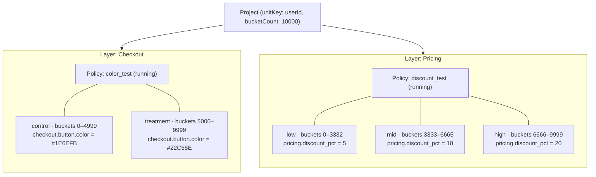

A **layer** is a pool of mutually exclusive policies over a disjoint set of parameters. Within a layer, a user can be in only one policy at a time. Across layers, assignments are statistically independent.



A user resolves once per layer. Each layer hashes independently, so the two assignments above are uncorrelated.

## Why layers exist

The day you run more than one experiment at a time, you create a risk: if a user is simultaneously in two experiments that affect related parameters, you can't cleanly attribute the observed behaviour to either one.

Layers solve this by partitioning the parameter space:

- **Within a layer** — only one policy applies to a given user. Mutual exclusivity is guaranteed.
- **Across layers** — policies can overlap freely because they control different parameters. Independence is guaranteed by orthogonal bucketing.

<Note>
Every project has a **base layer** that's created automatically. New parameters land in the base layer by default. The base layer can't be deleted.
</Note>

## Orthogonal bucketing

Each layer computes the user's bucket independently:

```
bucket = hash(unitKey + layerId) % bucketCount
```

Because the layer ID is mixed into the hash, a user's bucket in Layer A carries no information about its bucket in Layer B. The two assignments are statistically independent. This is what makes concurrent experiments safe.

`bucketCount` is a project-level setting (default `10000`). A higher count gives finer-grained allocation ranges and smoother rollouts.

### Example

Two concurrent experiments in different layers:

| Layer | Experiment | Parameters |
|-------|-----------|------------|
| Layer 1 | Checkout color test | `checkout.button.color` |
| Layer 2 | Pricing experiment | `pricing.discount_pct` |

User `user_789` gets:
- **Layer 1**: `hash("user_789" + "layer_1") % 10000 = 3420` → Control (range 0–4999)
- **Layer 2**: `hash("user_789" + "layer_2") % 10000 = 8170` → Treatment (range 5000–9999)

The two assignments are independent. Measuring the effect of the color change isn't confounded by the pricing change.

## Bucket ranges

Each layer has `bucketCount` buckets (typically 10000). The policies within a layer divide that space into non-overlapping allocation ranges:

```
Layer: Checkout experiments  (bucketCount: 10000)
├── Policy: color_test (running)
│   ├── control:   buckets 0–4999    → button.color = "#1E6EFB"
│   └── treatment: buckets 5000–9999 → button.color = "#22C55E"
│
└── (remaining parameters get default values)
```

For static A/B tests the ranges are fixed. For adaptive policies the optimization engine adjusts the ranges over time, shifting traffic toward better-performing allocations. For [rollouts](/experimentation/rollouts) the ranges expand outward in increments.

## Organising parameters into layers

A few guidelines:

- **Group parameters tested together.** If `checkout.button.color` and `checkout.button.text` are always swept in the same experiment, put them in the same layer.
- **Separate independent concerns.** Pricing experiments belong in a different layer from UI experiments.
- **Use the base layer for stable configuration.** Parameters that are essentially always on, or that you only flip occasionally for kill-switches, are fine in the base layer.

<Note>
A parameter belongs to exactly one layer. You can move a parameter between layers in the dashboard, but every move resets the assignment — users will hash into different buckets in the new layer.
</Note>

## Eligible bucket ranges

A policy can optionally narrow itself to a sub-range of the layer (an **eligible bucket range**). This is how you fit several non-overlapping experiments inside a single layer:

```
Layer: Marketing experiments  (bucketCount: 10000)
├── Policy: hero_test         eligible range 0–4999
└── Policy: cta_test          eligible range 5000–9999
```

Users outside a policy's eligible range skip it entirely.

## Next steps

<CardGroup cols={2}>
  <Card title="Policies" icon="route" href="/concepts/policies">
    How allocations and targeting work inside a layer.
  </Card>
  <Card title="A/B testing" icon="flask" href="/experimentation/ab-testing">
    Run your first experiment.
  </Card>
</CardGroup>
