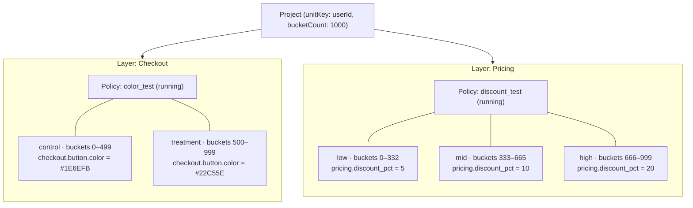

A **layer** is a lane for your traffic. Inside a layer, a user is in at most one test at a time. Across layers, tests overlap freely and independently, so every layer sees your full population.

That is the whole idea. Everything else on this page follows from one rule: **a parameter belongs to exactly one layer.**

## What layers are for

Once you run more than a couple of tests at the same time, two things go wrong:

- **Tests collide.** Two tests on the same page, on the same users, with the same goal. Nobody can say which one moved the number, and in the worst case the two variants together produce a broken page.
- **Tests wait.** To avoid collisions, teams start scheduling tests one after another, and the checkout team ends up waiting for the search team to finish.

Layers give you both isolation and concurrency, per product area, decided once:

| | Same layer | Different layers |
|---|---|---|
| Can a user be in both tests? | Never | Yes, independently |
| Traffic each test sees | The layer's traffic is shared between them | Each test sees the full population |
| When to use | Tests that would interfere: same surface, same goal, or both setting the same parameter | Tests on different surfaces or with different goals |

Because your code reads parameters and never names an experiment, a layer can retire one test and start the next without a deploy. Web, mobile and backend all pick up the new policy on their next config refresh.

## Which layer does a test belong in?

Ask one question per product area: *may two tests here run on the same user at the same time?*

| Situation | Decision |
|---|---|
| Same surface, same users, same goal | Same layer, so they cannot overlap |
| One test's variant would break the other's, such as layout versus copy on one page | Same layer |
| Both tests want to set the same parameter | Same layer. A parameter has one home, so this is automatic |
| Different surfaces or different goals | Different layers, run them concurrently |
| Different randomization unit, such as merchant versus customer | Different layer, always |

Two shapes to avoid:

- **One giant layer.** If every parameter lands in the base layer, every change in the project waits on every other change.
- **One layer per experiment.** You lose the collision guarantee on exactly the surfaces where it matters, and the layer list becomes noise.

The cost of sharing a layer, stated plainly: tests in the same layer share its users.

| Setup | Users per test |
|---|---|
| Two tests, one layer, half each | 50% |
| Two tests, two layers | 100% each |
| Five tests, one layer | 20% each |

## Setting up layers: one per surface

The recommended shape is **one layer per surface**. A [surface](/concepts/surfaces) is a product area such as PDP, Cart, Checkout or Onboarding. When you create a surface in the dashboard, choose **Create a new layer** and the surface gets its own lane, named after it. Parameters bound to that surface land in that layer.

<Steps>
  <Step title="Name your surfaces">
    Six is plenty to start. A surface is a product area with one owning team and one primary goal. For a shop: Sitewide, PDP, Cart, Shipping & Offers, Post-purchase.
  </Step>
  <Step title="Create each surface with its own layer">
    In **Surfaces → New surface**, keep **Create a new layer** selected. Pick the randomization unit as the surface's default entity if it differs from your project default.
  </Step>
  <Step title="Put parameters in the layer of the surface that consumes them">
    Platform values nobody tests, such as kill switches and timeouts, stay in the base layer.
  </Step>
  <Step title="Split only when a layer is congested">
    When two teams keep waiting on each other in one layer, split it along the team boundary, between tests.
  </Step>
</Steps>

<Note>
Every project has a **base layer** that's created automatically and can't be deleted. It holds stable parameters shared across the project. If you don't set up surface layers, all parameters end up there and your tests will queue behind each other. A [feature flag](/experimentation/feature-flags) gets its own layer, so flags never queue behind each other or behind the base layer.
</Note>

A backend service and the frontend that renders its output can share a layer only if both randomize on the same unit and the backend receives the same unit key. If different teams own them, give each its own layer with the same unit.

## How assignment works

A user resolves once per layer. Each layer computes the user's bucket independently:


```mermaid
flowchart TB
    Project["Project (unitKey: userId, bucketCount: 1000)"]

    subgraph L1["Layer: Checkout"]
        direction TB
        L1P1["Policy: color_test (running)"]
        L1P1A1["control · buckets 0–499<br/>checkout.button.color = #1E6EFB"]
        L1P1A2["treatment · buckets 500–999<br/>checkout.button.color = #22C55E"]
        L1P1 --- L1P1A1
        L1P1 --- L1P1A2
    end

    subgraph L2["Layer: Pricing"]
        direction TB
        L2P1["Policy: discount_test (running)"]
        L2P1A1["low · buckets 0–332<br/>pricing.discount_pct = 5"]
        L2P1A2["mid · buckets 333–665<br/>pricing.discount_pct = 10"]
        L2P1A3["high · buckets 666–999<br/>pricing.discount_pct = 20"]
        L2P1 --- L2P1A1
        L2P1 --- L2P1A2
        L2P1 --- L2P1A3
    end

    Project --> L1
    Project --> L2
```

### Orthogonal bucketing

```
bucket = hash(unitKey + layerId) % bucketCount
```

Because the layer ID is mixed into the hash, a user's bucket in Layer A carries no information about their bucket in Layer B. The two assignments are statistically independent. This is what makes concurrent experimentation safe.

`bucketCount` is a project-level setting (default `1000`). A higher count gives finer-grained allocation ranges and smoother rollouts.

User `user_789` in the example above gets:

- **Checkout**: `hash("user_789" + "checkout") % 1000 = 342` → control (range 0–499)
- **Pricing**: `hash("user_789" + "pricing") % 1000 = 817` → high (range 666–999)

Measuring the effect of the colour change isn't confounded by the pricing change.

### Bucket ranges

Each layer has `bucketCount` buckets. The policies within a layer divide that space into non-overlapping allocation ranges:

```
Layer: Checkout  (bucketCount: 1000)
├── Policy: color_test (running)
│   ├── control:   buckets 0–499   → button.color = "#1E6EFB"
│   └── treatment: buckets 500–999 → button.color = "#22C55E"
│
└── (remaining parameters get default values)
```

For static A/B tests the ranges are fixed. For adaptive policies the optimizer adjusts the ranges over time, shifting traffic toward better-performing allocations. For [rollouts](/experimentation/rollouts) the ranges expand in increments during forward ramping, and can shrink again on rollback or a manual percentage decrease.

Advancing a change from canary to experiment to rollout reuses the same slice of the layer, so nobody is re-randomized mid-flight.

### Eligible bucket ranges

A policy can optionally narrow itself to a sub-range of the layer (an **eligible bucket range**). This is how you fit several non-overlapping policies inside a single layer:

```
Layer: Marketing  (bucketCount: 1000)
├── Policy: hero_test         eligible range 0–499
└── Policy: cta_test          eligible range 500–999
```

Users outside a policy's eligible range skip it entirely.

## Moving a parameter between layers

<Warning>
A parameter belongs to exactly one layer. You can move it in the dashboard, but every move re-randomizes that parameter's users, because the bucket depends on the layer. Move parameters between tests, never while a policy overrides them.
</Warning>

## Next steps

<CardGroup cols={2}>
  <Card title="Surfaces" icon="window-maximize" href="/concepts/surfaces">
    Product areas, and how each one gets its own layer.
  </Card>
  <Card title="Policies" icon="route" href="/concepts/policies">
    How allocations and targeting work inside a layer.
  </Card>
  <Card title="Changes" icon="diagram-project" href="/concepts/changes">
    The lifecycle from canary to rollout inside one layer.
  </Card>
  <Card title="A/B testing" icon="flask" href="/experimentation/ab-testing">
    Run your first A/B test.
  </Card>
</CardGroup>
