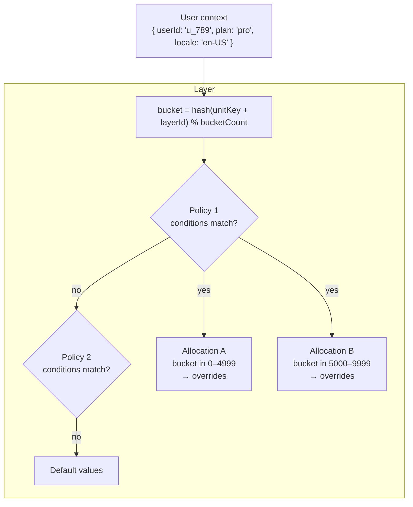

A **policy** is the rule that overrides parameter values for selected users within a [layer](/concepts/layers). Every experiment, every feature flag rollout, and every adaptive optimizer in Traffical is a policy.



A policy consists of:

- **Allocations** — variants the user can be assigned to, each with a bucket range and a set of parameter overrides
- **Conditions** (optional) — context predicates restricting who is eligible
- **Eligible bucket range** (optional) — restricts the policy to a sub-range of the layer
- **Algorithm configuration** — only for adaptive policies (Thompson Sampling, contextual bandits, etc.)
- **Rollout configuration** (optional) — turns the policy into a [progressive rollout](/experimentation/rollouts)

## Policy states

A policy moves through a small lifecycle:

| State | Description |
|-------|-------------|
| `draft` | Not yet active. Users are not assigned. |
| `running` | Active. Users are assigned based on allocations and conditions. |
| `paused` | Temporarily inactive. Users fall through to the next policy or to defaults. |
| `completed` | Finished. The winning allocation can be promoted to the parameter default and the policy archived. |

## Static vs adaptive

<Tabs>
  <Tab title="Static">
    **Static policies** have allocations with fixed bucket ranges. They don't change unless you explicitly update them or attach a rollout. Use static policies for:

    - A/B tests with fixed traffic splits
    - Targeted overrides for specific segments
    - Holdout groups

    ```
    Policy: checkout_color_test (static, running)
    ├── control:   buckets 0–4999   → button.color = "#1E6EFB"
    └── treatment: buckets 5000–9999 → button.color = "#22C55E"
    ```
  </Tab>
  <Tab title="Adaptive">
    **Adaptive policies** let the optimization engine adjust allocations based on observed rewards. Use them for:

    - Continuous traffic shifting toward better-performing variants
    - Personalized variant selection based on user context (contextual bandits)
    - Per-entity optimization (one bandit per product, per merchant, etc.)

    ```
    Policy: pricing_optimizer (adaptive, running)
    ├── low:    buckets 0–2999   → discount_pct = 5
    ├── medium: buckets 3000–6999 → discount_pct = 10   ← currently winning
    └── high:   buckets 7000–9999 → discount_pct = 20
    ```

    Allocation ranges shift over time as the engine learns. The SDK doesn't know or care — it just resolves from the latest bundle.
  </Tab>
</Tabs>

## Allocations

An allocation maps a bucket range to a set of parameter overrides.

- **Name** — a label like `control`, `treatment_a`, `low_price`
- **Bucket range** — `[start, end]` within the layer's bucket space
- **Overrides** — parameter keys and the values to use for users in this allocation

When the SDK resolves, it computes the user's bucket for the layer, picks the first eligible policy, and finds the allocation whose range contains that bucket. The overrides are merged on top of the parameter defaults.

## Targeting conditions

A policy can declare conditions that restrict eligibility based on context fields. All conditions must pass (AND).

<Accordion title="Condition operators">
| Operator | Description | Example |
|----------|-------------|---------|
| `eq` | Equals | `locale eq "en-US"` |
| `neq` | Not equals | `plan neq "free"` |
| `gt` / `gte` | Greater than (or equal) | `age gte 18` |
| `lt` / `lte` | Less than (or equal) | `cart_total lt 50` |
| `in` | In list | `country in ["US", "CA", "GB"]` |
| `nin` | Not in list | `role nin ["admin", "internal"]` |
| `contains` | String contains | `email contains "@company.com"` |
| `regex` | Regex match | `user_agent regex "Mobile.*"` |
</Accordion>

Example — only users in Germany or Austria:

```json
{
  "conditions": [
    { "field": "locale", "op": "in", "values": ["de-DE", "de-AT"] }
  ]
}
```

If a user doesn't match, the SDK skips this policy and falls through to the next eligible one — or to the parameter default if none match.

## Adaptive algorithms

Adaptive policies specify an algorithm and a goal:

| Algorithm | Use case |
|-----------|----------|
| `thompson_bernoulli` | Binary outcomes (clicked / didn't, converted / didn't). Beta-Bernoulli Thompson Sampling. |
| `epsilon_greedy` | Exploits the best-known variant most of the time; explores randomly with probability epsilon. |
| `ucb1` | Upper Confidence Bound. Optimistic exploration that decreases naturally over time. |
| `linear_contextual` | Personalized scoring per user. The SDK uses context features and trained coefficients (shipped in the bundle) to score each allocation locally. |

See [Optimization](/experimentation/optimization) for algorithm details.

## Per-entity adaptive policies

A standard A/B test learns *one* answer for the whole user base. Sometimes that's the wrong shape. Each product page might have a different best image order. Each merchant might convert better with a different recommendation algorithm. Each user segment might respond to a different email tone.

A **per-entity adaptive policy** runs one bandit per entity:

```yaml
entityConfig:
  entityKeys: ["productId"]
  resolutionMode: "bundle"    # or "edge"
```

- `entityKeys` — the field(s) in `context` that identify the entity (e.g. `productId`, `userId`, `merchantId`).
- `resolutionMode: "bundle"` — entity weights are shipped in the config bundle; the SDK resolves locally (sub-millisecond, but weights are only as fresh as the bundle).
- `resolutionMode: "edge"` — the SDK calls Traffical for each decision and gets the latest weights. Higher latency but real-time freshness.

### Dynamic allocations

When each entity has a different number of options (e.g. each product has a different image count), use `dynamicAllocations`:

```yaml
entityConfig:
  entityKeys: ["productId"]
  dynamicAllocations:
    countKey: "imageCount"
```

If `context.imageCount = 5`, the SDK creates allocations `["0", "1", "2", "3", "4"]` and selects the one with the highest learned weight. The selected index is reported as the allocation name on the resulting decision.

See the [per-entity adaptive pattern](/guides/canonical-experiments#per-entity-adaptive) for an end-to-end walkthrough.

## Contextual bandits (personalized policies)

A contextual bandit personalizes the assignment based on user context features. Different users see different variants — and the model learns which features predict which variant performs best.

The training pipeline produces coefficients per allocation. Those coefficients ship in the config bundle. At resolution time the SDK computes a score per allocation from the user's context and selects via softmax — all locally, no network call.

Two things you need to know:

- **Context logging allowlist** — only the context fields you explicitly opt in to are logged with exposure events. This protects PII while still giving the trainer signal to learn from.
- **Exploration is preserved** — the softmax has a temperature (`gamma`) and a minimum action probability (`actionProbabilityFloor`) so the model keeps exploring as it learns.

See [Optimization](/experimentation/optimization#contextual-bandits) for the full details.

## Eligible bucket ranges

A policy can optionally narrow itself to a sub-range of the layer:

```json
{ "eligibleBucketRange": { "start": 0, "end": 4999 } }
```

Only users whose layer bucket falls within this range see the policy. Outside that range, the policy is invisible. This is the simplest way to run several non-overlapping experiments inside one layer.

## Next steps

<CardGroup cols={2}>
  <Card title="A/B testing" icon="flask" href="/experimentation/ab-testing">
    Run a static policy end-to-end.
  </Card>
  <Card title="Optimization" icon="chart-line" href="/experimentation/optimization">
    Adaptive policies, contextual bandits, per-entity bandits.
  </Card>
  <Card title="Rollouts" icon="forward" href="/experimentation/rollouts">
    Turn a policy into a progressive rollout with health checks.
  </Card>
  <Card title="Canonical experiments" icon="book-open" href="/guides/canonical-experiments">
    The common patterns and how to model them.
  </Card>
</CardGroup>
