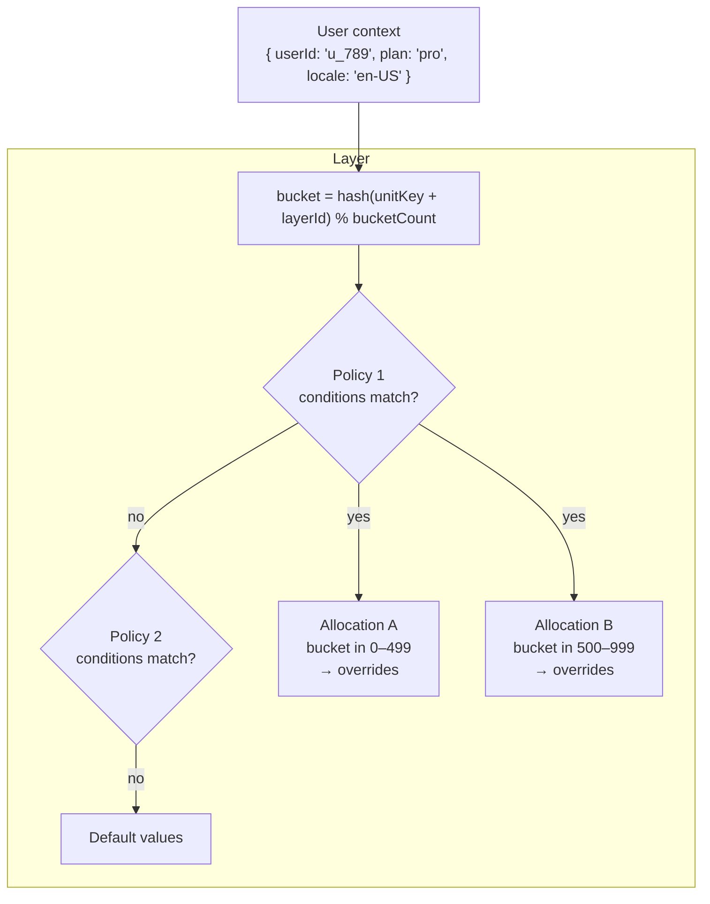

A **policy** is the rule that overrides parameter values for selected users within a [layer](/concepts/layers). Every A/B test, every feature flag rollout, and every adaptive optimizer in Traffical is a policy.


```mermaid
flowchart TB
    User["User context<br/>{ userId: 'u_789', plan: 'pro', locale: 'en-US' }"]

    subgraph Layer
        direction TB
        Bucket["bucket = hash(unitKey + layerId) % bucketCount"]
        P1{"Policy 1<br/>conditions match?"}
        P2{"Policy 2<br/>conditions match?"}
        A1["Allocation A<br/>bucket in 0–499<br/>→ overrides"]
        A2["Allocation B<br/>bucket in 500–999<br/>→ overrides"]
        Default["Default values"]
    end

    User --> Bucket
    Bucket --> P1
    P1 -->|yes| A1
    P1 -->|yes| A2
    P1 -->|no| P2
    P2 -->|no| Default
```

A policy consists of:

- **[Allocations](/concepts/terminology#allocations-and-traffic-splits)** — the named bundles of parameter overrides the user can be assigned to, each with a bucket range and a share of the policy's traffic
- **Conditions** (optional) — context predicates restricting who is eligible
- **Eligible bucket range** (optional) — restricts the policy to a sub-range of the layer
- **Algorithm configuration** — only for adaptive policies (Thompson Sampling, contextual bandits, etc.)
- **Rollout configuration** (optional) — turns the policy into a [progressive rollout](/experimentation/rollouts)

<Note>
Policies are often created for you: when a [change](/concepts/changes) moves through its lifecycle, each traffic-carrying phase materializes a policy in the layer with the change's approved measurement plan attached. You can still create and operate policies directly — a change is governance on top, not a replacement.
</Note>

## Policy states

A policy moves through a small lifecycle:

| State | Description |
|-------|-------------|
| `draft` | Not yet active. Users are not assigned. |
| `running` | Active. Users are assigned based on allocations and conditions. |
| `paused` | Temporarily inactive. Users fall through to the next policy or to defaults. |
| `completed` | Finished. The winning allocation can be promoted to the parameter default and the policy archived. |

## Static vs adaptive

<Tabs>
  <Tab title="Static">
    **Static policies** have allocations with fixed bucket ranges. They don't change unless you explicitly update them or attach a rollout. Use static policies for:

    - A/B tests with fixed traffic splits
    - Targeted overrides for specific segments
    - Holdout groups

    ```
    Policy: checkout_color_test (static, running)
    ├── control:   buckets 0–499   → button.color = "#1E6EFB"
    └── treatment: buckets 500–999 → button.color = "#22C55E"
    ```
  </Tab>
  <Tab title="Adaptive">
    **Adaptive policies** let the optimizer adjust allocations based on observed rewards. Use them for:

    - Continuous traffic shifting toward better-performing allocations
    - Personalized allocation selection based on user context (contextual bandits)
    - Per-entity optimization (one bandit per product, per merchant, etc.)

    ```
    Policy: pricing_optimizer (adaptive, running)
    ├── low:    buckets 0–299   → discount_pct = 5
    ├── medium: buckets 300–699 → discount_pct = 10   ← currently winning
    └── high:   buckets 700–999 → discount_pct = 20
    ```

    Allocation ranges shift over time as the optimizer learns. The SDK doesn't know or care — it just resolves from the latest bundle.
  </Tab>
</Tabs>

## Allocations

An allocation maps a bucket range to a set of parameter overrides.

- **Name** — a label like `control`, `treatment_a`, `low_price`
- **Bucket range** — `[start, end]` within the layer's bucket space
- **Overrides** — parameter keys and the values to use for users in this allocation

When the SDK resolves, it computes the user's bucket for the layer, picks the first eligible policy, and finds the allocation whose range contains that bucket. The overrides are merged on top of the parameter defaults.

## Targeting conditions

A policy can declare conditions that restrict eligibility based on context [attributes](/concepts/attributes). All conditions must pass (AND).

### Operators

| Operator | Description | Example |
|----------|-------------|---------|
| `eq` | Equals | `locale eq "en-US"` |
| `neq` | Not equals | `plan neq "free"` |
| `in` | In list | `country in ["US", "CA", "GB"]` |
| `nin` | Not in list | `role nin ["admin", "internal"]` |
| `gt` / `gte` | Greater than (or equal) — numbers only | `age gte 18` |
| `lt` / `lte` | Less than (or equal) — numbers only | `cart_total lt 50` |
| `contains` | String contains | `email contains "@company.com"` |
| `startsWith` | String starts with | `path startsWith "/checkout"` |
| `endsWith` | String ends with | `email endsWith "@company.com"` |
| `regex` | Regex match | `user_agent regex "Mobile.*"` |
| `exists` | Field is present and not null | `email exists` |
| `notExists` | Field is absent or null | `referrer notExists` |

Which operators are offered for a field depends on the attribute's registered type — see the [type table](/concepts/attributes#types-and-formats).

### Strict typing

SDKs compare values **without coercion**. `eq` is strict equality, `in` is strict membership, and the relational operators only compare numbers: `cart_value gte 100` never matches a context value of `"100"`, and `app_version gte "2.0.0"` never matches anything. `contains`, `startsWith`, `endsWith`, and `regex` require both sides to be strings.

The coercion happens at save time instead. When a condition targets a [registered attribute](/concepts/attributes), the dashboard and the API convert the condition value to the attribute's declared type before storing it — so a `number` attribute stores `100`, a `boolean` stores `true`, a `timestamp` stores epoch milliseconds — and validate enum membership, country codes, ranges, and regex syntax. Unregistered fields are stored exactly as entered.

### Field lookup

A condition's `field` is looked up in the context in two steps:

1. **Flat key first.** If the context has a property named exactly `field` — dots included — that value is used, even when it is `null`.
2. **Nested path.** Otherwise the field is split on `.` and walked into nested objects.

So `user.plan` matches both `{ "user.plan": "pro" }` and `{ user: { plan: "pro" } }`; when both are present the flat key wins. A missing path never errors — it is treated as absent.

### Examples

Only users in Germany or Austria:

```json
{
  "conditions": [
    { "field": "locale", "op": "in", "values": ["de-DE", "de-AT"] }
  ]
}
```

Pin your own developer IDs into a policy, whatever field this layer buckets on. `$unit_key` is replaced with the layer's actual unit-key field when the bundle is built; the wizard's **Add test users** button inserts it for you:

```json
{
  "conditions": [
    { "field": "$unit_key", "op": "in", "values": ["u_dev_1", "u_dev_2"] }
  ]
}
```

Run a policy in one environment only. `$env` is resolved when each environment's bundle is built, so the SDK never has to send it:

```json
{
  "conditions": [
    { "field": "$env", "op": "eq", "value": "staging" }
  ]
}
```

If a user doesn't match, the SDK skips this policy and falls through to the next eligible one — or to the parameter default if none match.

## Adaptive algorithms

Adaptive policies specify an algorithm and a goal:

| Algorithm | Use case |
|-----------|----------|
| `thompson_bernoulli` | Binary outcomes (clicked / didn't, converted / didn't). Beta-Bernoulli Thompson Sampling. |
| `epsilon_greedy` | Exploits the best-known allocation most of the time; explores randomly with probability epsilon. |
| `ucb1` | Upper Confidence Bound. Optimistic exploration that decreases naturally over time. |
| `linear_contextual` | Personalized scoring per user. The SDK uses context features and trained coefficients (shipped in the bundle) to score each allocation locally. |

See [Optimization](/experimentation/optimization) for algorithm details.

## Per-entity adaptive policies

A standard A/B test learns *one* answer for the whole user base. Sometimes that's the wrong shape. Each product page might have a different best image order. Each merchant might convert better with a different recommendation algorithm. Each user segment might respond to a different email tone.

A **per-entity adaptive policy** runs one bandit per entity:

```yaml
entityConfig:
  entityKeys: ["productId"]
  resolutionMode: "bundle"    # or "edge"
```

- `entityKeys` — the field(s) in `context` that identify the entity (e.g. `productId`, `userId`, `merchantId`).
- `resolutionMode: "bundle"` — entity weights are shipped in the config bundle; the SDK resolves locally (sub-millisecond, but weights are only as fresh as the bundle).
- `resolutionMode: "edge"` — the SDK calls Traffical for each decision and gets the latest weights. Higher latency but real-time freshness.

### Dynamic allocations

When each entity has a different number of options (e.g. each product has a different image count), use `dynamicAllocations`:

```yaml
entityConfig:
  entityKeys: ["productId"]
  dynamicAllocations:
    countKey: "imageCount"
```

If `context.imageCount = 5`, the SDK creates allocations `["0", "1", "2", "3", "4"]` and selects the one with the highest learned weight. The selected index is reported as the allocation name on the resulting decision.

See the [per-entity adaptive pattern](/guides/canonical-experiments#per-entity-adaptive) for an end-to-end walkthrough.

## Contextual bandits (personalized policies)

A contextual bandit personalizes the assignment based on user context features. Different users see different allocations — and the model learns which features predict which allocation performs best.

The training pipeline produces coefficients per allocation. Those coefficients ship in the config bundle. At resolution time the SDK computes a score per allocation from the user's context and selects via softmax — all locally, no network call.

Two things you need to know:

- **Context logging allowlist** — only the context fields you explicitly opt in to are logged with decision and exposure events. This protects PII while still giving the trainer signal to learn from. A registered [attribute's](/concepts/attributes#logging) `logging` setting applies on top: `always` keys are logged for every policy, `never` keys for none. The same allowlist governs [server-side resolution](/concepts/attributes#server-side-resolution), which never writes the raw request context.
- **Exploration is preserved** — the softmax has a temperature (`gamma`) and a minimum action probability (`actionProbabilityFloor`) so the model keeps exploring as it learns.

See [Optimization](/experimentation/optimization#contextual-bandits) for the full details.

## Eligible bucket ranges

A policy can optionally narrow itself to a sub-range of the layer:

```json
{ "eligibleBucketRange": { "start": 0, "end": 499 } }
```

With the default 1000 buckets, this policy covers the first half of the layer. Only users whose layer bucket falls within this range see the policy. Outside that range, the policy is invisible. This is the simplest way to run several non-overlapping policies inside one layer.

## Next steps

<CardGroup cols={2}>
  <Card title="A/B testing" icon="flask" href="/experimentation/ab-testing">
    Run a static policy end-to-end.
  </Card>
  <Card title="Optimization" icon="chart-line" href="/experimentation/optimization">
    Adaptive policies, contextual bandits, per-entity bandits.
  </Card>
  <Card title="Rollouts" icon="forward" href="/experimentation/rollouts">
    Turn a policy into a progressive rollout with health checks.
  </Card>
  <Card title="Experimentation patterns" icon="book-open" href="/guides/canonical-experiments">
    The common patterns and how to model them.
  </Card>
</CardGroup>
