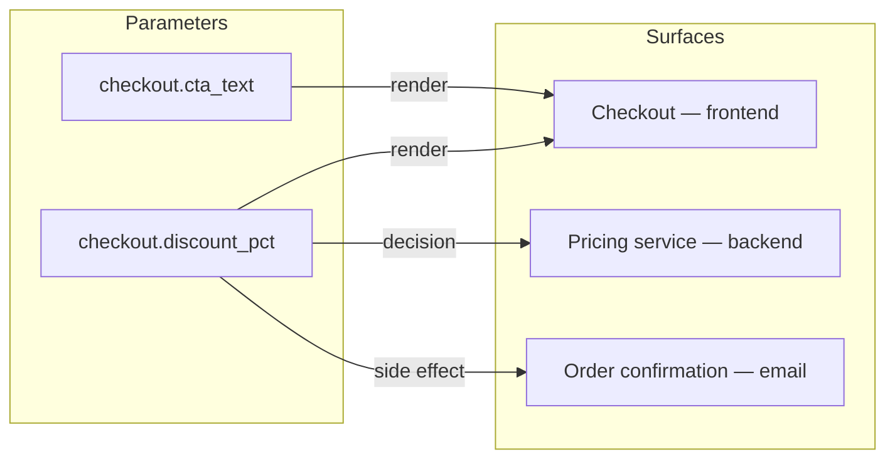

A **surface** is a product or system context where parameterized behavior shows up: a product detail page, checkout, a backend pricing service, a marketing email, a ranking model. [Parameters](/concepts/parameters) describe *what* can vary; surfaces describe *where* the variation lands and what it can affect.

A surface is not a [layer](/concepts/layers). A layer is a traffic container that controls bucketing and mutual exclusion. A surface carries product meaning and measurement context — which part of your product a change touches, how risky that is, and which measurement rules should apply.

You create surfaces rarely, but they're referenced every time you create a [change](/concepts/changes): the change's **primary** and **impacted** surfaces define its measurement context, drive which [measurement protocols](/governance/measurement-protocols) match, and set its risk class.

## What a surface is

Each surface has:

- **Name and key** — a human-readable name (`Checkout`) and a stable URL-safe key (`checkout`)
- **Kind** — the category of context (see below)
- **Default layer** (optional) — the layer changes on this surface typically run in
- **Default entity** (optional) — the randomization entity changes on this surface typically use

The default layer and entity are descriptive setup hints shown on the surface's list and detail pages. The layer a change actually runs in comes from its selected parameters, and that layer's own entity remains the source of truth for bucketing.

## Surface kinds

Every surface has one of eight kinds:

| Kind | Examples |
|------|----------|
| `frontend` | Product page, checkout, onboarding flow, mobile screen |
| `backend` | Pricing service, search service, API behavior |
| `email` | Transactional or marketing email |
| `notification` | Push or in-app notification |
| `ranking` | Search ranking, recommendation ordering, feed sorting |
| `ai` | Prompts, model selection, agent behavior |
| `data` | Data processing or transformation behavior |
| `other` | Anything that doesn't fit the above |

The kind isn't just a label — it sets the base [risk class](#surfaces-drive-risk) for any change that touches the surface.

## Parameter bindings

A **binding** connects a parameter to a surface that consumes it. Bindings are many-to-many: one parameter can bind to several surfaces, and one surface usually consumes several parameters. Each binding declares a **role** (how the surface uses the value) and a **measurement requirement**, plus optional notes for ownership or blast radius.

### Binding roles

| Role | Meaning | Example |
|------|---------|---------|
| `render` | The surface displays the value | Checkout renders `checkout.cta_text` on the pay button |
| `decision` | The surface branches on the value | The pricing service picks a code path based on `pricing.strategy` |
| `write` | The surface mutates or resolves the value | A backend service computes the final `search.ranking_algo` config |
| `read` | The surface reads the value but doesn't act on it | A logging pipeline records `checkout.cta_text` for context |
| `side_effect` | The value triggers a downstream effect | `checkout.discount_pct` changes what the order confirmation email says |

Roles matter for two reasons. A role that can mutate behavior (`decision`, `write`, `side_effect`) bumps the change's risk class one rung. And the New Change wizard uses roles to guess the primary surface — a surface the change decides or writes on outranks one that merely renders.

### Measurement requirement

Each binding is either **Optional** or **Must be measured**:

- **Must be measured** — a change touching this surface needs a matching certified measurement protocol. If no protocol covers the surface, the change's measurement plan carries an unresolved risk: the plan is never approved automatically, so the change can't reach traffic — or advance into experiment or rollout phases — without a human explicitly signing off on the gap. A reviewer can approve over it, for example to run a small health-checked canary while you close it, but automation never will.
- **Optional** — measurement is nice-to-have and never blocks a change.

<Tip>
Mark bindings on your revenue-critical surfaces as **Must be measured**. It's the cheapest way to guarantee no unmeasured change reaches checkout traffic without a human explicitly signing off.
</Tip>

## Surfaces drive risk

Every change gets a computed risk class on the ladder **low → medium → high → critical**, and surfaces provide both inputs: the highest-risk **kind** among the change's primary and impacted surfaces sets the base, and any binding role that can mutate behavior (`decision`, `write`, `side_effect`) bumps it one rung. A render-only copy change on a frontend surface classifies **low**; the same change whose parameter also drives a backend decision classifies **high**.

The full model — the kind-to-base-risk table, the no-surface default, and what each class gates — lives in [Approvals and autonomy](/governance/approvals-and-autonomy#risk-classes). You can override the computed class when creating a change, and the dashboard shows the reasoning either way (for example, "medium — backend surface, decision binding").

## Where surfaces show up

<Note>
Changes is enabled per organization. If you don't see **Changes** in your sidebar, it isn't enabled for your organization yet.
</Note>

### The New Change wizard

The wizard's **Surfaces & Measurement** step asks for a **primary surface** (the main product context) and any **impacted surfaces** (other contexts the change may affect). Both are pre-seeded from your selected parameters' bindings: the impacted set is every other surface those parameters bind to (the primary is tracked separately, not repeated in the impacted list), and the primary is a best guess ranked by binding role and surface kind. You can override either.

As you adjust surfaces, the wizard recomputes the risk class live and nudges you when risk rises — adding a backend surface to a frontend copy change visibly changes what approval the change will need. See [Changes in the dashboard](/dashboard/changes).

### Measurement protocol matching

[Measurement protocols](/governance/measurement-protocols) declare which changes they apply to — including a set of target surfaces. When a change's measurement plan resolves, Traffical collects the change's full surface set (primary, impacted, and every surface bound to its parameters) and matches it against certified protocols. Matched protocols merge their metric, guardrail, and diagnostic rules into the plan. A **Must be measured** surface with no matching certified protocol becomes an unresolved risk on the plan.

### The impact view

The project home's impact section can be filtered by surface, so you can answer "what did we ship through checkout this quarter?" separately from "what did we ship in search?". The program-level win rate stays project-wide regardless of the filter.

## Managing surfaces in the dashboard

Open **Surfaces** in the project sidebar.

<Frame caption="The Surfaces list">
  
</Frame>

The list shows each surface's name and key, kind, default layer, and how many parameter bindings it has. Click **New surface** to create one — you set the name, key, description, kind, default layer, and default entity.

### Surface detail

A surface's detail page has two tabs:

- **Overview** — the changes that reference this surface (badged **Primary** or **Impacted**, with their state), the measurement protocols that target it, and a details rail with kind, default layer, default entity, and binding count.
- **Settings** — the parameter bindings table. Click **Bind parameter** to add a binding, pick the role and the measurement requirement, and it saves immediately. A legend explains each role and requirement inline.

<Frame caption="Surface detail — Settings tab">
  
</Frame>

From the header, **New change on this surface** jumps straight into the wizard with the parameter list filtered to this surface's bound parameters and the primary surface pre-selected. **Edit surface** reopens the create dialog.

## Best practices

- **Model surfaces at product granularity, not page granularity.** "Checkout" is a surface; "checkout step 2 shipping form" usually isn't. You want a handful of surfaces you'd recognize in a quarterly review.
- **Bind honestly.** If a parameter's value flows into an email or a downstream service, add that binding with the right role — the risk computation and protocol matching are only as good as the bindings.
- **Record default layers.** They document at a glance where changes on this surface typically run, for anyone reviewing the surface.

## Next steps

<CardGroup cols={2}>
  <Card title="Changes" icon="waypoints" href="/concepts/changes">
    The governed lifecycle that surfaces anchor.
  </Card>
  <Card title="Measurement protocols" icon="clipboard-check" href="/governance/measurement-protocols">
    Certified measurement rules matched by surface.
  </Card>
  <Card title="Approvals and autonomy" icon="shield-check" href="/governance/approvals-and-autonomy">
    How risk class translates into required sign-off.
  </Card>
  <Card title="Changes in the dashboard" icon="layout-dashboard" href="/dashboard/changes">
    Creating and running changes, step by step.
  </Card>
</CardGroup>
