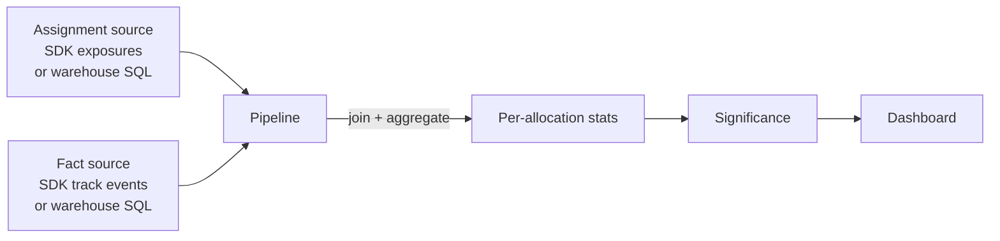

Traffical can compute metrics from two sources:

1. **Traffical-native events** — the track events your SDKs send. The platform stores them and aggregates them. Zero setup beyond `traffical.track()`.
2. **Warehouse-native** — SQL queries you write against your own data warehouse (Postgres, BigQuery, Snowflake, Databricks, ClickHouse). Traffical executes them, joins assignments to outcomes, and produces the same per-allocation statistics.

You can use one, the other, or both at once. The dashboard treats them identically.

## When to use warehouse-native

Use warehouse-native when:

- You already have a warehouse as the system of record. You don't want a second event pipeline to keep in sync.
- The outcomes you care about live in places SDKs don't see — subscription renewals, support tickets, manual refunds, batch-processed conversions.
- You're migrating from another experimentation tool. Your assignments are already being written somewhere; Traffical analyses them in place.
- You want SQL-level control over what counts as a conversion (deduplication, joins, filters).

Use Traffical-native when:

- You're starting fresh and don't want to think about a warehouse yet.
- The outcome events are naturally captured by an SDK — clicks, purchases, signups, page views.

## The four definition types

Warehouse-native is built on four kinds of definitions. The names are deliberately boring — they describe what they are.

| Definition | What it describes |
|------------|-------------------|
| **Entity** | The unit of randomization (User, Company, Device). What kind of thing gets assigned to a variant. |
| **Assignment** | Where assignments live — SQL that returns one row per (entity, time, policy, allocation). |
| **Fact** | Where outcomes live — SQL that returns events you want to measure (purchases, signups, ticket creates). |
| **Metric** | How to aggregate a fact into a number per allocation (conversion rate, sum, count). |

### Entity definitions

An entity describes the unit of randomization. The most common is a User keyed on `userId`. A B2B platform might have a Company entity keyed on `companyId`.

```yaml
entities:
  user:
    keyType: userId
  company:
    keyType: companyId
```

The entity's key type must match the unit key of the project's experiments.

### Assignment definitions

An assignment definition is the SQL that produces the mapping between an entity and the variant it was assigned to. This is what tells Traffical "user 123 saw `treatment` of `pricing_test` at 10:30am".

```yaml
assignments:
  pricing_assignments:
    entity: user
    sql: |
      SELECT
        user_id,
        assigned_at,
        experiment_name AS policy_key,
        variant        AS allocation_key
      FROM analytics.experiment_assignments
      WHERE assigned_at BETWEEN '{{start_date}}' AND '{{end_date}}'
```

Required columns:

- the entity key (here `user_id`)
- `assigned_at` — when the assignment took effect
- `policy_key` — must match the `key` of a Traffical policy
- `allocation_key` — must match the `key` of one of that policy's allocations

If you're using a Traffical SDK to do the assigning, you get the same effect for free — the SDK ships exposure events to Traffical and the platform manages the assignment table for you. You only need to write an assignment definition if assignments come from somewhere else.

### Fact definitions

A fact definition is SQL that produces outcome events.

```yaml
facts:
  orders:
    entity: user
    sql: |
      SELECT
        user_id,
        event_time,
        order_total
      FROM analytics.orders
      WHERE event_time BETWEEN '{{start_date}}' AND '{{end_date}}'
```

A single fact can power many metrics. The `orders` fact above could be aggregated into "revenue per user" (sum of `order_total`), "conversion rate" (any order), or "order count".

A fact can also span multiple entities — useful when an event is associated with both a user and a company.

### Metric definitions

A metric definition links a fact to an aggregation:

```yaml
metrics:
  revenue_per_user:
    fact: orders
    aggregation: sum
    valueColumn: order_total

  purchase_rate:
    fact: orders
    aggregation: conversion_rate

  orders_per_user:
    fact: orders
    aggregation: count
```

Available aggregations:

| Aggregation | Numerator | Denominator | Output |
|-------------|-----------|-------------|--------|
| `conversion_rate` | Unique entities with at least one fact event | Unique entities exposed | Proportion |
| `sum` | Sum of `valueColumn` across fact events | Unique entities exposed | Per-entity average |
| `count` | Count of fact events | Unique entities exposed | Per-entity rate |

## The pipeline

When a metric is configured, Traffical runs a pipeline on a schedule:

1. Reads assignments (from your warehouse SQL, or from Traffical's exposure events if SDK-managed)
2. Reads facts (from your warehouse SQL, or from Traffical's track events)
3. Joins them by entity key and time
4. Computes the per-allocation statistic
5. Runs significance tests

Results land in the dashboard.



You don't have to think about the pipeline's internals — connectors, scheduling, retry — but you do need to give Traffical:

- A connection to your warehouse with read access to your source data and read + write access to a Traffical-owned schema (the pipeline writes intermediate tables there)
- The SQL for each definition

Connections are configured per project in the dashboard. Supported warehouses: Postgres, BigQuery, Snowflake, Databricks, ClickHouse.

## Hybrid mode

Most setups end up hybrid:

- SDK-managed assignments for new experiments (no SQL to write)
- Warehouse facts for outcomes that live in the warehouse anyway (orders, renewals)
- Traffical-native track events for outcomes the SDK captures naturally (clicks, page views)

The dashboard unifies all of them.

## SDK → warehouse sync (optional)

If you want your SDK events to land in your warehouse too — for ad-hoc analysis, ML pipelines, or compliance — Traffical can sync exposure and track events into a table you specify. This is configured per project; once it's on, every event ingested also lands in your warehouse on a regular cadence.

## Next steps

<CardGroup cols={2}>
  <Card title="Decisions & attribution" icon="link" href="/concepts/assignments">
    How decision IDs connect SDK events to assignments.
  </Card>
  <Card title="External-assignments pattern" icon="book-open" href="/guides/canonical-experiments#warehouse-native-external-assignments">
    Migrating from another tool while keeping its assignments.
  </Card>
  <Card title="Optimization" icon="chart-line" href="/experimentation/optimization">
    Contextual bandits trained from warehouse data.
  </Card>
</CardGroup>
