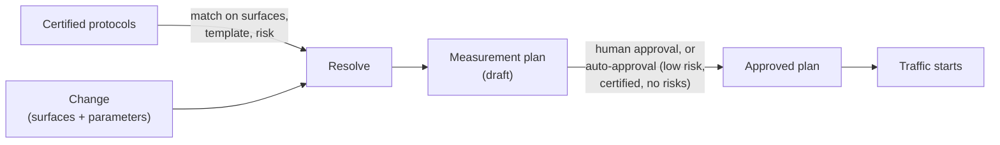

A **measurement protocol** is a versioned, certifiable measurement standard: which metrics matter, which guardrails must hold, and what statistical bar each phase must clear for a class of changes. Define the standard once, certify it, and every [change](/concepts/changes) it covers inherits it automatically.

When a change is created, Traffical matches your certified protocols against it and resolves them into a **measurement plan** — a per-change snapshot of exactly how that change will be measured. One rule holds throughout:

<Warning>
A change cannot expose traffic without an approved measurement plan. Low-risk changes with fully certified coverage are approved automatically when traffic starts; everything else waits for a human.
</Warning>

## Why protocols

Without a standard, every experiment picks its metrics ad hoc — and the fifth checkout experiment measures something subtly different from the first four. Protocols move that decision from each change to the team: whoever owns measurement defines and certifies the standard, and every change on a covered surface gets the right metrics, guardrails, and statistical requirements without anyone re-deciding them. Agents starting changes through the [MCP server](/tools/mcp-server) face exactly the same standard as humans in the dashboard.

## What a protocol contains

A protocol has an applicability predicate (which changes it covers) and up to four kinds of rules (what it requires of them).

### Applicability

A protocol declares which changes it applies to using four optional dimensions:

| Dimension | Matches when |
|-----------|--------------|
| **Surfaces** | The change touches any of the listed [surfaces](/concepts/surfaces) |
| **Change templates** | The change's measurement template is in the list |
| **Risk classes** | The change's computed risk class is in the list |
| **Parameter keys** | The change includes any of the listed parameters |

A dimension you leave empty matches everything; every dimension you set must match. A protocol scoped only to the checkout surface applies to all checkout changes regardless of template or risk.

The measurement template is derived from the change's shape and surfaces: `gradual_rollout`, `canary_experiment_rollout`, `adaptive_optimization`, `prompt_model_tuning` (any change touching an AI surface), or `backend_threshold_tuning` (a backend surface with a threshold-style numeric parameter). The risk class — `low`, `medium`, `high`, or `critical` — is computed from the kinds of surfaces the change touches and how its parameters bind to them; see [Approvals & autonomy](/governance/approvals-and-autonomy).

### Metric rules

Each metric rule attaches a metric from your project with a role:

- **Primary** — the decision-driving outcome. A plan carries exactly one.
- **Secondary** — supporting outcomes, reported alongside the primary.
- **Exploratory** — directional signals with no bearing on the verdict.

### Guardrail rules

Guardrails are the "do no harm" side of the plan. Each rule sets:

- **Direction** — `must not increase` (e.g. error rate), `must not decrease` (e.g. conversion), or `within range`
- **Threshold** — the relative regression tolerated before the guardrail fires, entered as a percentage (e.g. 1%)
- **Severity** — `warning` flags the change for review; `blocking` is enforced automatically: when a blocking guardrail turns failing on a running phase, the monitor applies the phase's armed breach action — pausing the [policy](/concepts/policies) by default, reverting or recording only when configured — and writes a [decision record](/dashboard/decisions) citing the evidence.

A guardrail can be restricted to specific phases (canary, experiment, rollout, adaptive): it's only evaluated on the phases it names, and one with no restriction applies to every phase. That lets a strict error-rate guardrail police the canary while a looser revenue guardrail waits for the experiment.

### Diagnostic rules

Diagnostics are named data-quality checks, each declared with an `info`, `warning`, or `blocking` severity. They're recorded on the protocol and carried onto the resolved plan, so reviewers see the data-quality expectations the standard sets — separate from whether the treatment is winning — alongside the metrics and guardrails.

### Per-phase rules

Beyond metrics and guardrails, a protocol can set phase-specific requirements:

| Phase | Requirements |
|-------|--------------|
| **Canary** | Health metrics, blocking guardrails, minimum runtime (hours), minimum exposures |
| **Experiment** | Primary metric, guardrails, minimum runtime, minimum sample size, and statistical design targets — relative MDE, alpha, and power |
| **Rollout** | Health metrics; whether to roll back automatically on a violation |
| **Adaptive** | Guardrails; approval mode for the optimizer's moves (automatic, human approval, or agent recommendation) |

The experiment design targets drive runtime and sample-size estimates for the change. When you leave them blank, system defaults apply — alpha 0.05, power 0.80, relative MDE 5% — and the estimates are labeled as assumed. See [Statistics](/statistics/overview) for how significance is computed.

## Protocol lifecycle

A protocol moves through three states:

| State | Meaning |
|-------|---------|
| `draft` | Editable. Doesn't count as certified coverage — a change measured only by draft protocols needs human plan approval. |
| `certified` | The reviewed, binding version. Immutable — changes require a new version. |
| `deprecated` | Retired. No longer matched to new changes. |

Certifying is deliberate: a protocol can only be certified when every metric it references is itself certified, and certification is a separate [permission](/governance/roles-and-permissions) from editing. Once certified, the protocol can't be edited in place — **New version** creates a fresh draft to iterate on, and certifying that new version deprecates the prior certified one. Plans that were resolved from the old version keep their pinned snapshot; nothing changes retroactively.

<Tip>
Before certifying, use **Preview matches** on the protocol page to see how many existing changes touch the protocol's surfaces. The preview counts by surface only — it doesn't narrow by template, risk class, or parameter keys.
</Tip>

## From protocols to a measurement plan

When a change resolves its plan, Traffical collects the change's surfaces (its primary surface, declared impacted surfaces, and every surface its parameters bind to), derives the measurement template and risk class, and matches all certified protocols against them. If no certified protocol matches, draft protocols are used as a cold-start fallback — but each one is flagged as an unresolved risk on the plan.

Matched rules are merged into a single plan:

- **Metric roles are reconciled by precedence.** A metric that is primary in any protocol is primary; it never appears in two roles.
- **Competing guardrails collapse to the strictest.** When two protocols constrain the same metric in the same direction, the plan keeps the higher severity and the lower threshold, and notes the reconciliation.
- **One primary survives.** If several protocols contribute primaries, the change's stated objective designates the winner and the rest demote to secondary. Multiple primaries with no designation is an unresolved risk — and a hard block on approval until a human disambiguates.

The result is a snapshot, not a reference: the plan records its source protocols with their exact versions, the resolved metric sets, guardrails, diagnostics, phase rules, the computed risk class, a one-line resolution summary, and any unresolved risks. Certifying a newer protocol version later doesn't rewrite a plan that already exists — re-resolve the plan if you want the new rules, which supersedes the old one.

### Plan states

| State | Meaning |
|-------|---------|
| `draft` | Resolved but not yet signed off. The change cannot take traffic. |
| `approved` | Signed off by a human — or auto-approved for a clean low-risk change. The change's active plan. |
| `superseded` | Replaced by a newer resolution or approval. Kept for the record. |

### Unresolved risks

The resolver is honest about gaps. A plan records an unresolved risk when:

- No certified protocol matched the change at all
- The plan was built from draft (uncertified) protocols
- A manually added metric isn't certified
- Multiple primary metrics resolved with no designated objective
- An experiment-template change resolved no primary metric
- A required surface has no matching certified protocol
- The change's parameters span multiple layers

Unresolved risks are annotations, not gates you can't pass: a human can approve a plan that carries risks (except the multiple-primaries case, which is structurally invalid), and the risks stay recorded on the approved plan as part of the sign-off. What they always do is veto auto-approval — the system never approves over a flagged risk on your behalf.

## The start gate

Every path that starts traffic — the dashboard, an agent calling the [MCP server](/tools/mcp-server), an automated phase advance — passes through the same gate. When traffic is about to start, one of three things happens:

1. **An approved plan exists.** The start proceeds; metrics and guardrails are attached.
2. **The plan qualifies for auto-approval.** The latest plan is low risk, built entirely from certified protocols, and carries zero unresolved risks — the system approves it on your behalf and the start proceeds. This is what makes routine, well-covered changes frictionless.
3. **The start is blocked.** With certified coverage but a higher risk class, the change waits for a human to approve the plan. With no certified protocol coverage at all, the start is blocked with: "No certified measurement protocol matches this change — a human must approve a measurement plan before exposing traffic."

<Note>
Manual metric choices pass through the same validation. A manually added metric that isn't certified is tracked as an unresolved risk, which disables auto-approval — a human has to sign off, with the gap recorded next to the signature. A certified metric added manually carries no risk.
</Note>

## Where this lives in the dashboard

<Note>
The Changes surface is enabled per organization. If you don't see **Changes** in the sidebar, it isn't enabled for your organization yet.
</Note>

### Protocols pages

Protocols live under **Metrics** → **Protocols**. The list shows every protocol with its version, state, and certification date, filterable by state.

<Frame caption="The Protocols list">
  
</Frame>

<Steps>
  <Step title="Create a draft">
    Click **New protocol**. Name it, set the applicability (surfaces, change templates, risk classes), and add metric rules, guardrails, and the experiment design targets (MDE, alpha, power).
  </Step>
  <Step title="Certify it">
    On the protocol page, click **Certify**. Certification requires every referenced metric to be certified and asks for explicit confirmation — from that point the version is immutable and starts matching changes as certified coverage.
  </Step>
  <Step title="Iterate with versions">
    To change a certified protocol, click **New version**, edit the draft, and certify it. The prior certified version is deprecated automatically.
  </Step>
</Steps>

### The change's Plan tab

Every change's detail page has a **Plan** tab showing the resolved plan: its state badge, the resolution summary, primary and impacted surfaces, the source protocols with their pinned versions, the metric sets, guardrails and diagnostics, and any unresolved risks. From here you can **Resolve plan** (or re-resolve after editing the change) and **Approve plan**.

<Frame caption="A change's Plan tab">
  
</Frame>

When no protocol contributed a primary metric, the tab offers **Create a basic plan**: pick a primary metric and optional guardrails from your project's metric definitions, and the plan re-resolves with those manual choices. Any manual pick that isn't certified is recorded as an unresolved risk on the resulting plan.

## Next steps

<CardGroup cols={2}>
  <Card title="Changes" icon="git-pull-request" href="/concepts/changes">
    The unit of work protocols measure — phases, templates, and lifecycle.
  </Card>
  <Card title="Approvals & autonomy" icon="shield-check" href="/governance/approvals-and-autonomy">
    Risk classes and who (or what) may advance a change.
  </Card>
  <Card title="Metrics" icon="chart-line" href="/dashboard/metrics">
    Defining the metrics your protocols reference.
  </Card>
  <Card title="Working with changes" icon="table-columns" href="/dashboard/changes">
    The Changes pages end to end.
  </Card>
</CardGroup>
